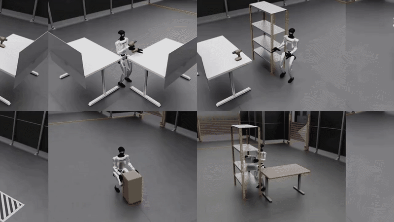
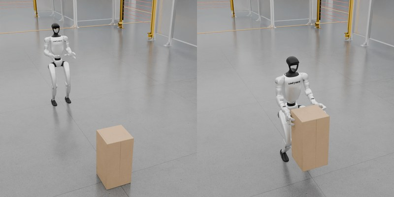
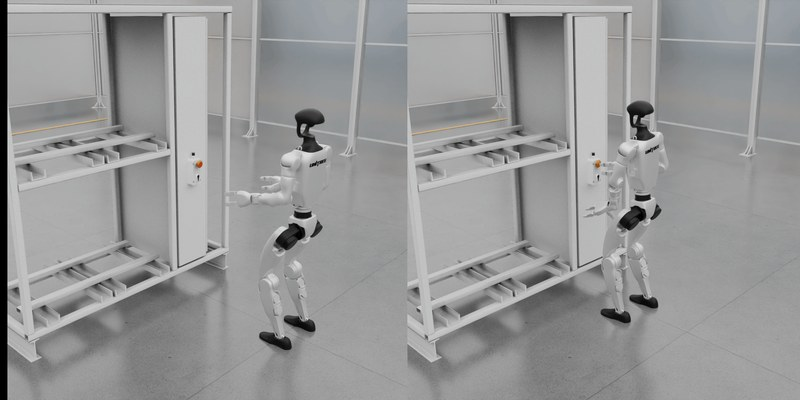
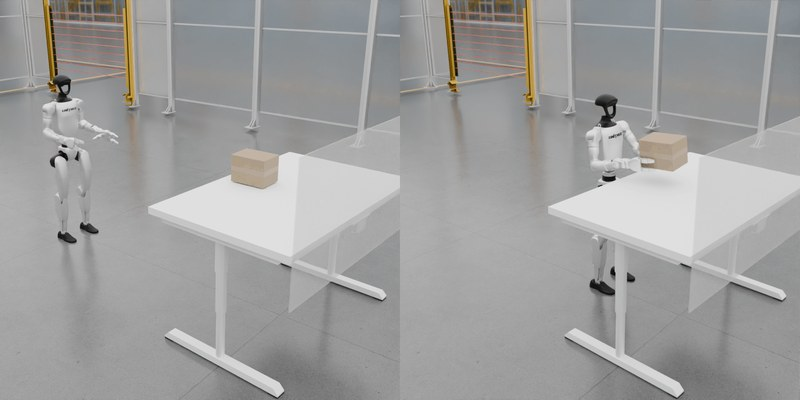
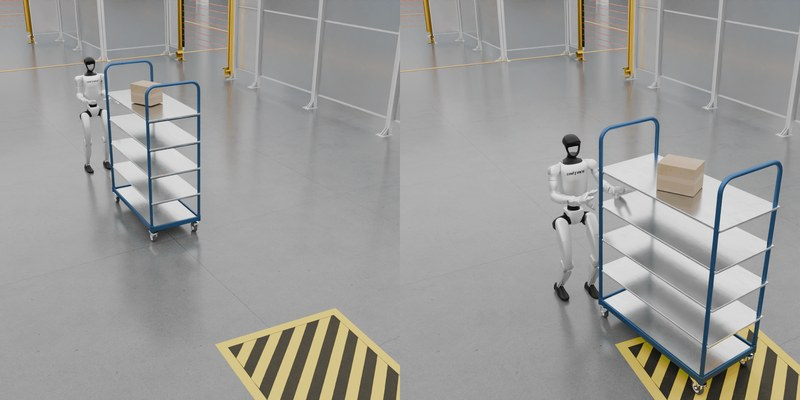
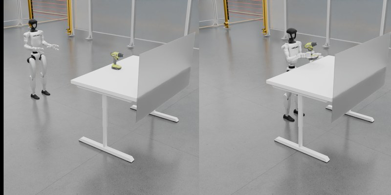
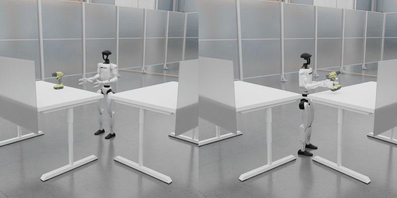
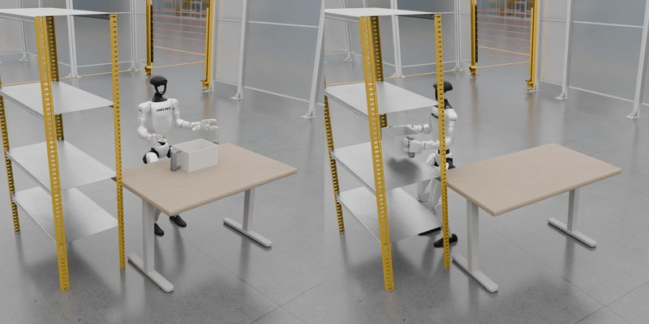
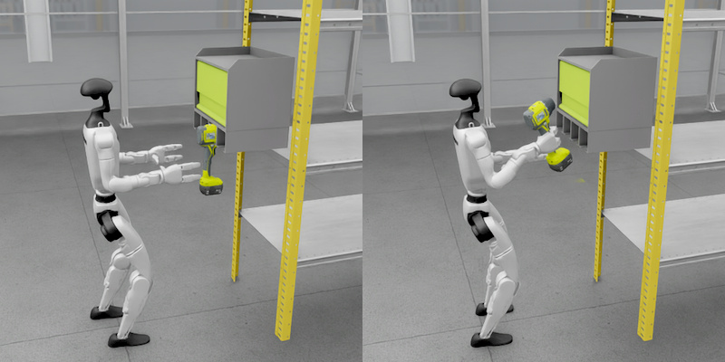
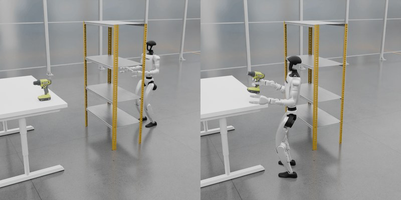

<div align="center">

  

</div>

<div align="center">

[](LICENSE)
[](https://humanoidmimicgen.github.io/)
[](https://arxiv.org/abs/2605.27724)

</div>

---

# HumanoidMimicGen

HumanoidMimicGen generates humanoid
loco-manipulation data by adapting contact-rich whole-body skills from source
demonstrations to new scenes. This release packages the project's nine G1
simulation environments, MuJoCo assets, whole-body controller (WBC), and
physics-correct recorded state/action playback, along with minimal examples for
policy training and native evaluation.

## Table of Contents

- [Requirements](#requirements)
- [Quick Start](#quick-start)
- [Common Examples](#common-examples)
- [G1 Loco-Manipulation Benchmark](#g1-loco-manipulation-benchmark)
- [Train and Evaluate a Policy](#train-and-evaluate-a-policy)
- [Dataset Playback](#dataset-playback)
- [What's Included](#whats-included)
- [Citation](#citation)
- [License](#license)

## Requirements

- Linux and Python 3.10
- An NVIDIA GPU and CUDA only for WBC execution or EGL rendering; recorded
  playback without rendering can run CPU-only
- `ffmpeg` only when generating a downscaled replay video
- External datasets for playback

MuJoCo is pinned to `3.2.6` and RoboSuite to `1.5.1`. Datasets, generated
outputs, and optional lower-body ONNX weights are not stored in this repository.

## Quick Start

```bash
git clone https://github.com/NVlabs/humanoidmimicgen.git
cd humanoidmimicgen

python3.10 -m venv .venv
source .venv/bin/activate
python -m pip install --upgrade pip
python -m pip install -e ".[wbc-replay]"

# Required only for WBC-goal or random-action execution.
python -m humanoidmimicgen.download_wbc_policies

# Headless Linux rendering.
export MUJOCO_GL=egl
```

## Common Examples

### Run random actions

Smoke-test an environment and its WBC without a dataset:

```bash
python scripts/demo_random_action.py \
  --task LMPushButton \
  --steps 1000 \
  --seed 0
```

Rendering is opt-in:

```bash
python scripts/demo_random_action.py \
  --task LMPushButton \
  --steps 1000 \
  --seed 0 \
  --video-path /tmp/push_button_random.mp4
```

### Replay human source demonstrations

The public
[nine-task human source-demo replay episodes](https://huggingface.co/datasets/linkenv/humanoidmimicgen-g1-source-demo-replay)
contain one successful human-operated episode per task, including each
episode's exact MuJoCo XML scene:

```bash
hf download linkenv/humanoidmimicgen-g1-source-demo-replay \
  --repo-type dataset \
  --local-dir /path/to/hmg_source_demo_replay
```

```bash
python scripts/playback_dataset.py \
  /path/to/hmg_source_demo_replay/datasets/02_push_button/demo.hdf5 \
  --action-source state \
  --require-task-success \
  --video-path /tmp/push_button_source_demo.mp4
```

The `state` mode restores every recorded simulator state so the original human
trajectory can be visualized faithfully. It does not validate action or
physics fidelity.

Human source-demo HDF5 files also contain the stored wrist and upper-body WBC
goals needed to regenerate low-level actions. To exercise that path, use:

```bash
python scripts/playback_dataset.py \
  /path/to/hmg_source_demo_replay/datasets/02_push_button/demo.hdf5 \
  --action-source wbc-goal \
  --allow-state-divergence \
  --require-task-success \
  --video-path /tmp/push_button_wbc_goal.mp4
```

WBC-goal playback is an active simulation and may not reproduce every recorded
state exactly. `--allow-state-divergence` permits that trajectory difference;
`--require-task-success` still requires the task predicate to pass.

### Validate recorded-action physics

For exact action-driven regression, use the public
[nine-task recorded-action replay episodes](https://huggingface.co/datasets/linkenv/humanoidmimicgen-g1-nine-task-action-replay).
The bundle contains one validated seed-0 checkpoint-generated policy rollout
for every environment shipped here, under `datasets/<task>`:

```bash
hf download linkenv/humanoidmimicgen-g1-nine-task-action-replay \
  --repo-type dataset \
  --local-dir /path/to/hmg_nine_task_replay
```

```bash
python scripts/playback_dataset.py \
  /path/to/hmg_nine_task_replay/datasets/02_push_button \
  --action-source recorded \
  --num-episodes 1 \
  --state-atol 0
```

Replace `02_push_button` with any of the nine task directories listed in the
bundle. These replay episodes are for exact physics regression; they are not
policy-training datasets and make no benchmark-performance claim.

Add `--video-path /tmp/push_button_replay.mp4` when you also want an MP4.
The default `recorded` mode applies the dataset's low-level joint actions and
checks every resulting MuJoCo state. The published 1K replay datasets do not
store end-effector or upper-body WBC pose goals, so they support
`--action-source recorded` but not `--action-source wbc-goal`. WBC-goal replay
currently requires the human source-demo HDF5 files described above.

## G1 Loco-Manipulation Benchmark

### Nine industrial humanoid tasks.

Object lifting, pushing, placing, obstacle navigation, and shelf interaction on
a humanoid robot.

<table>
  <tr>
    <td width="33%" valign="top"><br><strong>Box Lift Floor</strong><br>Grasp the box from the floor and lift to a target height.</td>
    <td width="33%" valign="top"><br><strong>Push Button</strong><br>Approach an industrial panel and press its button.</td>
    <td width="33%" valign="top"><br><strong>Box Lift</strong><br>Approach the table, grasp the box, and lift to a target height.</td>
  </tr>
  <tr>
    <td valign="top"><br><strong>Push Shelf Forward</strong><br>Push the shelving cart into a marked target zone.</td>
    <td valign="top"><br><strong>Drill Lift</strong><br>Approach a table, grasp a drill, and lift to a target height.</td>
    <td valign="top"><br><strong>Drill PnP</strong><br>Pick a drill from one table and place it on a second table.</td>
  </tr>
  <tr>
    <td valign="top"><br><strong>Box Table To Shelf</strong><br>Transfer a box from a table into a shelf.</td>
    <td valign="top"><br><strong>Pick Drill From Holder</strong><br>Walk to the holder, grasp the drill, and lift it.</td>
    <td valign="top"><br><strong>Obstacle-Aware Pick Drill</strong><br>Navigate around a blocking shelf, then grasp and lift the drill.</td>
  </tr>
</table>

The public [HumanoidMimicGen G1 Loco-Manipulation Benchmark training dataset](https://huggingface.co/datasets/linkenv/humanoidmimicgen-g1-benchmark)
contains about 9K demonstrations across these nine tasks, generated with the
HumanoidMimicGen data-generation algorithm and organized into eight LeRobot
shards per task.

## Train and Evaluate a Policy

The sample policy training and evaluation scripts provide a minimal end-to-end
example using the upstream LeRobot Diffusion Policy at the exact tested
revision:

```bash
python -m pip install --upgrade \
  "lerobot @ git+https://github.com/huggingface/lerobot.git@8fff0fde7c79f23a93d845d1a50e985de01f8b8a"
python -m pip install --upgrade \
  --index-url https://download.pytorch.org/whl/cu128 \
  "torch==2.10.0" "torchvision==0.25.0"
python -m pip install --upgrade \
  "numpy==1.26.4" "opencv-python-headless==4.11.0.86"
```

The clean RTX 5090 reproduction used Python 3.10.19, PyTorch 2.10.0 with
CUDA 12.8, torchvision 0.25.0, NumPy 1.26.4, and OpenCV 4.11.0. The pinned
LeRobot source revision above is required.

Choose one task from the public benchmark. The training script downloads all
eight shards for that task from
[`linkenv/humanoidmimicgen-g1-benchmark`](https://huggingface.co/datasets/linkenv/humanoidmimicgen-g1-benchmark),
converts them to LeRobot v3, and projects them to the model's 43-dimensional
`observation.state`, `observation.images.ego_view`, and 35-dimensional WBC-goal
`action` contract. Downloads and prepared shards are cached under
`~/.cache/humanoidmimicgen/policy_data` by default.

For example, train Task06 using all eight released shards:

```bash
python scripts/train_policy_example.py \
  --task 06_drill_pnp \
  --output-dir ./outputs/task06_dp_long50 \
  --seed 1000
```

There is no dataset path or Hugging Face repo ID to discover. The script uses
the pinned public dataset above and creates the local LeRobot IDs automatically
(for example, `local/hmg_06_drill_pnp_shard_000`). Use `--data-dir` only to
place the download/preparation cache somewhere other than its default location.

This trains the validated 64-step prediction-horizon, 50-step action-chunk
configuration for 20K updates by default and saves every 5K updates. If the
process is interrupted, repeat the same command with `--resume`; the script
selects the newest complete checkpoint and restores its model, optimizer,
scheduler, RNG, and training step.

Download the WBC policies once to a known directory:

```bash
python -m humanoidmimicgen.download_wbc_policies \
  --output-dir ~/.cache/humanoidmimicgen/wbc_policies
```

Use 20 native episodes as a quick smoke test (seeds 0 through 19):

```bash
python scripts/evaluate_policy_example.py \
  --checkpoint-dir ./outputs/task06_dp_long50/checkpoints/020000 \
  --task 06_drill_pnp \
  --num-episodes 20 \
  --seed 0 \
  --wbc-policy-dir ~/.cache/humanoidmimicgen/wbc_policies \
  --output ./outputs/task06_dp_long50/eval_020000_smoke.json
```

For reported results, evaluate 100 episodes. This serial loop evaluates every
saved boundary without overlapping GPU jobs:

```bash
for step in 005000 010000 015000 020000; do
  python scripts/evaluate_policy_example.py \
    --checkpoint-dir "./outputs/task06_dp_long50/checkpoints/${step}" \
    --task 06_drill_pnp \
    --num-episodes 100 \
    --seed 0 \
    --wbc-policy-dir ~/.cache/humanoidmimicgen/wbc_policies \
    --output "./outputs/task06_dp_long50/eval_${step}_100ep.json"
done
```

Evaluation opens the model checkpoint and independently validates its optimizer,
scheduler, RNG, and training-step state when a full checkpoint directory is
provided. Tensor counts are checked per artifact and are not expected to match
across different state files.

Use `--help` on either script for the complete task and runtime options.

## Dataset Playback

`scripts/playback_dataset.py` accepts a LeRobot dataset root or source-demo
HDF5 file and reads the environment identity from its metadata.

| Mode | Behavior | Use |
|---|---|---|
| `recorded` | Restores the initial state, applies recorded actions, and checks each resulting state. | Physics replay (default) |
| `wbc-goal` | Regenerates low-level actions from recorded WBC goals stored in human source-demo HDF5 files. | WBC/task-behavior replay |
| `state` | Restores every recorded state without stepping physics. | Visualization only |

Playback fails on state divergence by default (`atol=1e-5`; use
`--state-atol 0` for exact equality). Add `--video-path` for an MP4 or
`--require-task-success` to require the task predicate.

> [!IMPORTANT]
> The published replay episodes are validated with this runtime. Other
> HMG-generated demos may not include the MuJoCo XML or a record of where fixed
> scene objects were placed. In those cases, restoring `states[0]` alone may not
> reproduce the original scene; faithful replay requires that missing scene
> information.
>
> `--action-source wbc-goal` is not supported for HMG-generated demos. It is
> only supported for the human source-demo HDF5 files described above.

## What's Included

| Component | Description |
|---|---|
| [`humanoidmimicgen/locomanipulation`](humanoidmimicgen/locomanipulation) | Nine environments, scene helpers, success predicates, and MJCF assets. |
| [`humanoidmimicgen/wbc`](humanoidmimicgen/wbc) | G1 WBC implementation, robot description, and configs. |
| [`scripts/demo_random_action.py`](scripts/demo_random_action.py) | Random-action environment and WBC smoke test, with optional rendering. |
| [`scripts/train_policy_example.py`](scripts/train_policy_example.py) | Sample policy training entrypoint with automatic shard discovery and the validated LeRobot 64/50 configuration. |
| [`scripts/evaluate_policy_example.py`](scripts/evaluate_policy_example.py) | Sample native HMG policy evaluation entrypoint for the resulting checkpoints. |
| [`scripts/playback_dataset.py`](scripts/playback_dataset.py) | Dataset playback CLI with optional MP4 rendering. |

## Citation

If you find HumanoidMimicGen useful in your research, please cite:

```bibtex
@article{lin2026humanoidmimicgen,
  title         = {HumanoidMimicGen: Data Generation for Loco-Manipulation via Whole-Body Planning},
  author        = {Kevin Lin and Ajay Mandlekar and Caelan Reed Garrett and
                   Nikita Chernyadev and Yu Fang and Runyu Ding and Yuqi Xie and
                   Justin Tran and Linxi Fan and Yuke Zhu},
  year          = {2026},
  eprint        = {2605.27724},
  archivePrefix = {arXiv},
  primaryClass  = {cs.RO},
  url           = {https://arxiv.org/abs/2605.27724}
}
```

## License

NVIDIA-authored source is licensed under Apache-2.0; see [LICENSE](LICENSE).
RoboCasa-derived source and assets, RoboSuite, RoboSuite Models, and Unitree G1
robot assets retain their respective licenses under [LICENSES](LICENSES).
Downloaded lower-body ONNX weights use the NVIDIA Open Model License.

See [THIRD_PARTY_NOTICES.md](THIRD_PARTY_NOTICES.md) for source and README-media
provenance, attributions, dependency-license references, and distribution
notices.

## Contributing and Security

See [CONTRIBUTING.md](CONTRIBUTING.md) before submitting changes and
[SECURITY.md](SECURITY.md) for private security-reporting instructions.
