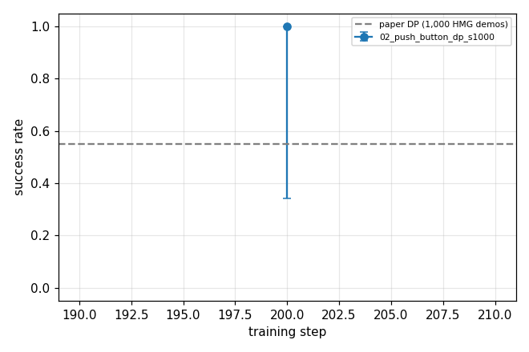

# HumanoidMimicGen (G1, MuJoCo) baseline 결과 (RTX 5070 12GB)

자동 생성: `experiments/tools/report.py`. 정책 = 공식 예제 Diffusion Policy (LeRobot, 64/50 chunk, batch 16). 평가 = 공식 `evaluate_policy_example.py` (MuJoCo + WBC closed-loop, seed 0..N-1, 1250 step 안에 성공 여부).

## 1. 학습

| run | step | 시간 | step/s | 마지막 loss | 최대 VRAM |
|---|---|---|---|---|---|
| `02_push_button_dp_s1000` | 200 / 200 | 0.02 h | - | 0.97 | 6083.0 MiB |

## 2. Closed-loop 성공률

| run | step | episode | 성공률 | 95% CI (Wilson) | 평균 길이 (step) |
|---|---|---|---|---|---|
| `02_push_button_dp_s1000` | 200 | 2 | **1.00** | [0.34, 1.00] | 324 |

### 학습 없는 기준 정책 (같은 평가 루프, 성공 판정의 바닥값)

| 정책 | episode | 성공률 | 95% CI | 평균 길이 |
|---|---|---|---|---|
| hold (가만히 서 있기) | 5 | 0.00 | [0.00, 0.43] | 1250 |
| mean (평균 행동 반복) | 5 | 0.20 | [0.04, 0.62] | 1040 |
| replay (시범 행동 열린 루프 재생) | 5 | 0.00 | [0.00, 0.43] | 1250 |

논문 값 (02_push_button, 1,000 demo, 100 rollout): DP (1,000 HMG demos) 0.55, Flow Matching 1.00, VLA (GR00T N1.6) 0.92, VLA, 100 human demos 0.82, VLA, 1 human demo 0.18. 우리 DP는 공식 예제 설정이라 논문 DP와 학습 설정이 같다는 보장은 없다 (논문은 DP 설정을 밝히지 않음).

