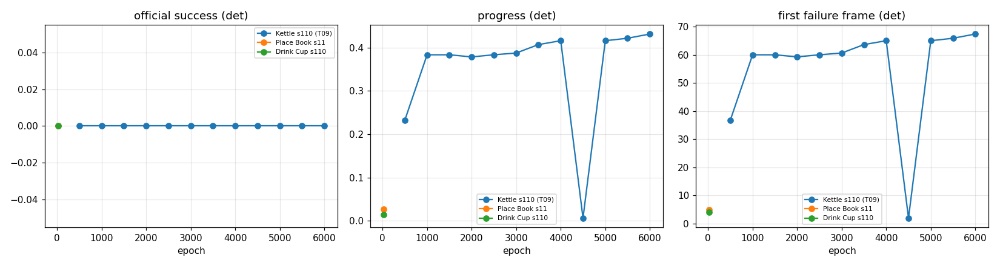

# ParaHome × WristMimic: T09 방법을 Drink Cup / Place Book에

자동 생성: `experiments/tools/report.py`. 방법, 설정, 평가기는 T09 baseline과 같고 **장면만** 다르다 (`experiments/docs/PROTOCOL.md`).

## 1. 같은 예산 비교 (epoch 21)

`det` = 결정적 행동 8 env, `stoch` = 학습 때 행동 잡음 32 env. 성공 = 시퀀스 끝까지 실패 조건 없음 (T09 공식). 과제 성공 = 물체가 참조에서 10 cm 이내 + 넘어지지 않음. 첫 실패 frame은 잡기/들기 frame(audit)과 같이 본다.

| 장면 | 평가 | 공식 성공 | 과제 성공 | 진행률 | 첫 실패 frame | 잡기 / 들기 frame | 물체 오차 | 접촉 재현율 | 손목 오차(창) | 넘어짐 | 첫 원인 (넘어짐/물체/접촉/손목/몸) |
|---|---|---|---|---|---|---|---|---|---|---|---|
| Place Book (s11) | det @21 | 0.00 | 0.00 | 0.03 | 5.0 | 16 / 45 | 0.870 m | 0.00 | 1.322 m | 1.00 | 0.00/0.00/0.00/0.00/1.00 |
| Drink Cup (s110) | det @21 | 0.00 | 0.00 | 0.02 | 4.0 | 23 / 47 | 0.257 m | 0.30 | 0.468 m | 1.00 | 0.00/0.00/0.00/0.00/1.00 |
| Kettle (s110, T09 장면) (T09 결과) | det @6000 | 0.00 | 0.00 | 0.43 | 67.4 | 26 / 47 | 0.795 m | 0.57 | 0.037 m | 1.00 | 0.00/0.38/0.00/0.00/0.88 |
| Kettle (s110, T09 장면) (T09 결과) | stoch @6000 | 0.00 | 0.00 | 0.32 | 50.0 | 26 / 47 | 0.916 m | 0.50 | 0.041 m | 1.00 | 0.00/0.44/0.00/0.41/0.19 |

## 2. 학습 곡선 (det)

**Kettle (s110, T09 장면)** (`default_s0_1004-175106`)

| epoch | 공식 성공 | 과제 성공 | 진행률 | 첫 실패 frame | 물체 오차 | 접촉 재현율 |
|---|---|---|---|---|---|---|
| 500 | 0.00 | 0.00 | 0.23 | 36.8 | 1.008 m | 0.34 |
| 1000 | 0.00 | 0.00 | 0.38 | 60.0 | 1.008 m | 0.33 |
| 1500 | 0.00 | 0.00 | 0.38 | 60.0 | 1.008 m | 0.59 |
| 2000 | 0.00 | 0.00 | 0.38 | 59.2 | 1.008 m | 0.65 |
| 2500 | 0.00 | 0.00 | 0.38 | 60.0 | 1.008 m | 0.62 |
| 3000 | 0.00 | 0.00 | 0.39 | 60.6 | 0.987 m | 0.63 |
| 3500 | 0.00 | 0.00 | 0.41 | 63.6 | 0.910 m | 0.38 |
| 4000 | 0.00 | 0.00 | 0.42 | 65.0 | 0.872 m | 0.67 |
| 4500 | 0.00 | 0.00 | 0.01 | 2.0 | 0.902 m | 0.48 |
| 5000 | 0.00 | 0.00 | 0.42 | 65.0 | 0.854 m | 0.45 |
| 5500 | 0.00 | 0.00 | 0.42 | 65.9 | 0.847 m | 0.76 |
| 6000 | 0.00 | 0.00 | 0.43 | 67.4 | 0.795 m | 0.57 |

**Place Book (s11)** (`wm_book_s11_default_s0`)

| epoch | 공식 성공 | 과제 성공 | 진행률 | 첫 실패 frame | 물체 오차 | 접촉 재현율 |
|---|---|---|---|---|---|---|
| 21 | 0.00 | 0.00 | 0.03 | 5.0 | 0.870 m | 0.00 |

**Drink Cup (s110)** (`wm_cup_s110_default_s0`)

| epoch | 공식 성공 | 과제 성공 | 진행률 | 첫 실패 frame | 물체 오차 | 접촉 재현율 |
|---|---|---|---|---|---|---|
| 21 | 0.00 | 0.00 | 0.02 | 4.0 | 0.257 m | 0.30 |

