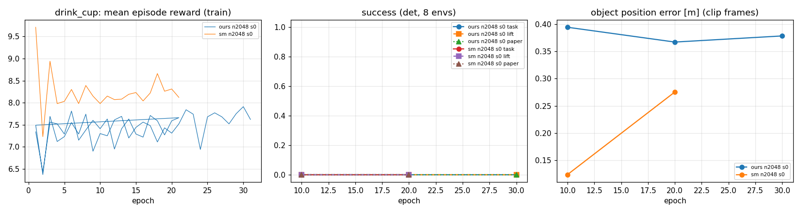

# SkillMimic-V2 ParaHome baseline 결과 (RTX 5070 12GB)

자동 생성: `experiments/tools/report.py`. 규칙과 지표 정의: `experiments/docs/PROTOCOL.md`.

## 1. 학습 run

| run | clip | method | env | epoch | 샘플 (논문 대비) | 학습 속도 | s/epoch | 시간 | 최대 VRAM | 마지막 보상 |
|---|---|---|---|---|---|---|---|---|---|---|
| `drink_cup_ours_n2048_s0` | drink_cup | ours | 2048 | 31 | 2M (0%) | 6131 samples/s | 10.7 | 0.2 h | 11168 MiB | 7.6 |
| `drink_cup_sm_n2048_s0` | drink_cup | sm | 2048 | 21 | 1M (0%) | 10133 samples/s | 6.5 | 0.0 h | 10926 MiB | 8.1 |

## 2. 최종 체크포인트

`det` = 결정적 행동 8 env (물리 잡음 반복), `stoch` = 학습 때와 같은 행동 잡음 32 env, `stoch_perturb` = 물체 시작 위치 교란 (yaw ±45°, xy ≤ 10 cm, 논문 ε-NSR).

| run | 평가 | epoch | 과제 성공 (T09 기준) | 들어올림 성공 | 논문 지표 | 논문 SR (참고) | clip 중 넘어짐 | 과제 진행률 | 물체 오차 | 몸 오차 |
|---|---|---|---|---|---|---|---|---|---|---|
| `drink_cup_ours_n2048_s0` | det | 30 | 0.00 | 0.00 | 0.00 | 100% | 0.75 | 0.04 | 0.378 m | 0.541 m |
| `drink_cup_ours_n2048_s0` | stoch | 30 | 0.00 | 0.00 | 0.00 | 100% | 0.97 | 0.19 | 0.359 m | 0.539 m |
| `drink_cup_ours_n2048_s0` | stoch_perturb | 30 | 0.00 | 0.00 | 0.00 | 100% | 0.97 | 0.06 | 0.756 m | 0.537 m |
| `drink_cup_sm_n2048_s0` | det | 20 | 0.00 | 0.00 | 0.00 | 0% | 1.00 | 0.01 | 0.275 m | 0.378 m |

## 3. 학습 곡선 (det, 8 env)

**`drink_cup_ours_n2048_s0`**

| epoch | 과제 성공 | 들어올림 성공 | 논문 지표 | 넘어짐 | 과제 진행률 | 물체 오차 | 최대 들어올림 |
|---|---|---|---|---|---|---|---|
| 10 | 0.00 | 0.00 | 0.00 | 1.00 | 0.21 | 0.394 m | 0.048 m |
| 20 | 0.00 | 0.00 | 0.00 | 0.75 | 0.01 | 0.367 m | 0.066 m |
| 30 | 0.00 | 0.00 | 0.00 | 0.75 | 0.04 | 0.378 m | 0.053 m |

**`drink_cup_sm_n2048_s0`**

| epoch | 과제 성공 | 들어올림 성공 | 논문 지표 | 넘어짐 | 과제 진행률 | 물체 오차 | 최대 들어올림 |
|---|---|---|---|---|---|---|---|
| 10 | 0.00 | 0.00 | 0.00 | 1.00 | 0.21 | 0.124 m | 0.048 m |
| 20 | 0.00 | 0.00 | 0.00 | 1.00 | 0.01 | 0.275 m | 0.066 m |

## 4. 그림

