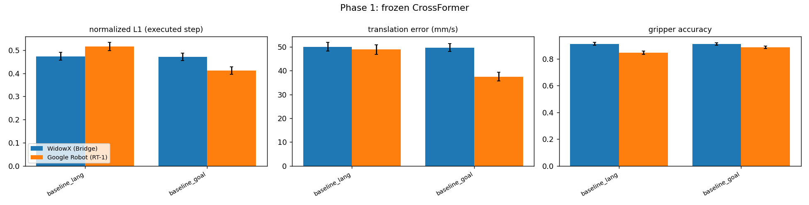
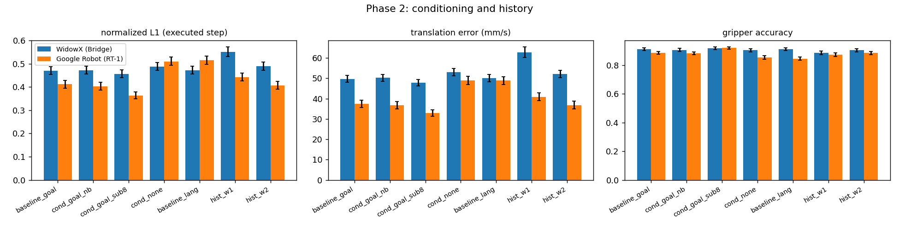
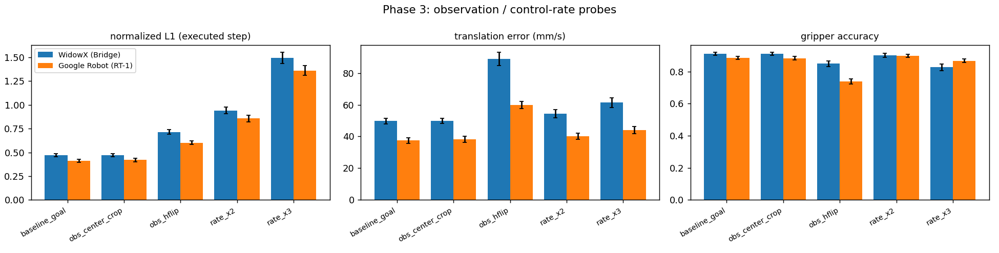
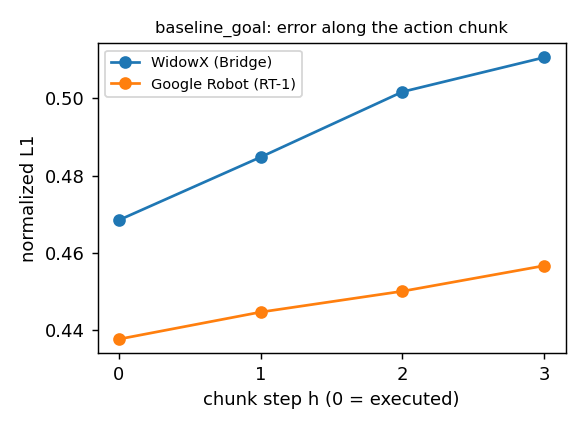
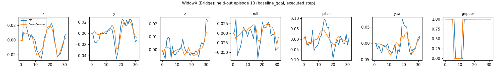
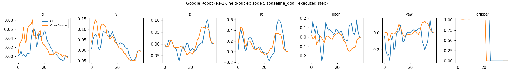

# T10 CrossFormer baseline report

자동 생성 파일 (`bash experiments/scripts/report.sh`). 해석 규칙은 `experiments/docs/PROTOCOL.md`.

평균은 episode 단위, [ ]는 episode bootstrap 95% CI. 오프라인 지표는 실행되는 첫 action(chunk step 0) 기준.

## 0. Embodiment별 action 규약 (데이터에서 측정)

Fit `dpos(t+lag) = A a_xyz(t) + b` (tools/conventions.py). Scale = singular values of A (metres per action unit); frame = rotation angle of the polar factor of A.

| dataset | embodiment | Hz | best lag | R^2 | scale (m/unit) | frame rot (deg) | step mm (median / p99) | p99 speed mm/s | gripper corr |
|---|---|---|---|---|---|---|---|---|---|
| bridge_dataset | widowx | 5 | 0 | 1.0 | 1.0000, 1.0000, 1.0000 | 0.0 | 13.25 / 52.95 | 264.7 | 0.826 |
| fractal20220817_data | google_robot | 3 | 1 | 0.7722 | 0.2893, 0.2644, 0.1877 | 3.43 | 15.97 / 82.02 | 246.1 | -0.712 |
| taco_play | franka | 15 | 2 | 0.7523 | 0.0165, 0.0138, 0.0119 | 5.98 | 5.05 / 22.34 | 335.1 | -0.108 |

## Phase 1 baseline

| variant | embodiment | episodes | norm L1 | trans err mm/step | trans err mm/s | dir cos | gripper acc | mag ratio (median) |
|---|---|---|---|---|---|---|---|---|
| baseline_lang | WidowX (Bridge) | 165 | 0.473 [0.456, 0.490] | 10.0 | 50 | 0.73 | 0.912 | 0.78 |
| baseline_lang | Google Robot (RT-1) | 342 | 0.515 [0.498, 0.533] | 16.3 | 49 | 0.60 | 0.845 | 0.48 |
| baseline_goal | WidowX (Bridge) | 165 | 0.470 [0.454, 0.488] | 9.9 | 50 | 0.73 | 0.911 | 0.82 |
| baseline_goal | Google Robot (RT-1) | 342 | 0.412 [0.395, 0.428] | 12.5 | 37 | 0.77 | 0.886 | 0.84 |

## Phase 2 conditioning / history

| variant | embodiment | episodes | norm L1 | trans err mm/step | trans err mm/s | dir cos | gripper acc | mag ratio (median) |
|---|---|---|---|---|---|---|---|---|
| baseline_goal | WidowX (Bridge) | 165 | 0.470 [0.454, 0.488] | 9.9 | 50 | 0.73 | 0.911 | 0.82 |
| baseline_goal | Google Robot (RT-1) | 342 | 0.412 [0.395, 0.428] | 12.5 | 37 | 0.77 | 0.886 | 0.84 |
| cond_goal_nb | WidowX (Bridge) | 165 | 0.471 [0.455, 0.489] | 10.0 | 50 | 0.73 | 0.906 | 0.84 |
| cond_goal_nb | Google Robot (RT-1) | 342 | 0.403 [0.386, 0.420] | 12.2 | 37 | 0.79 | 0.884 | 0.87 |
| cond_goal_sub8 | WidowX (Bridge) | 165 | 0.456 [0.441, 0.473] | 9.6 | 48 | 0.76 | 0.917 | 0.83 |
| cond_goal_sub8 | Google Robot (RT-1) | 342 | 0.364 [0.349, 0.379] | 11.0 | 33 | 0.84 | 0.920 | 0.86 |
| cond_none | WidowX (Bridge) | 165 | 0.488 [0.472, 0.506] | 10.6 | 53 | 0.70 | 0.905 | 0.76 |
| cond_none | Google Robot (RT-1) | 342 | 0.510 [0.493, 0.529] | 16.3 | 49 | 0.59 | 0.853 | 0.54 |
| baseline_lang | WidowX (Bridge) | 165 | 0.473 [0.456, 0.490] | 10.0 | 50 | 0.73 | 0.912 | 0.78 |
| baseline_lang | Google Robot (RT-1) | 342 | 0.515 [0.498, 0.533] | 16.3 | 49 | 0.60 | 0.845 | 0.48 |
| hist_w1 | WidowX (Bridge) | 165 | 0.551 [0.531, 0.573] | 12.6 | 63 | 0.60 | 0.886 | 0.64 |
| hist_w1 | Google Robot (RT-1) | 342 | 0.442 [0.426, 0.459] | 13.6 | 41 | 0.75 | 0.873 | 0.73 |
| hist_w2 | WidowX (Bridge) | 165 | 0.489 [0.472, 0.508] | 10.4 | 52 | 0.71 | 0.904 | 0.76 |
| hist_w2 | Google Robot (RT-1) | 342 | 0.407 [0.391, 0.424] | 12.3 | 37 | 0.79 | 0.885 | 0.77 |

## Phase 3 observation / rate probes

| variant | embodiment | episodes | norm L1 | trans err mm/step | trans err mm/s | dir cos | gripper acc | mag ratio (median) |
|---|---|---|---|---|---|---|---|---|
| baseline_goal | WidowX (Bridge) | 165 | 0.470 [0.454, 0.488] | 9.9 | 50 | 0.73 | 0.911 | 0.82 |
| baseline_goal | Google Robot (RT-1) | 342 | 0.412 [0.395, 0.428] | 12.5 | 37 | 0.77 | 0.886 | 0.84 |
| obs_center_crop | WidowX (Bridge) | 165 | 0.470 [0.454, 0.488] | 9.9 | 50 | 0.73 | 0.911 | 0.82 |
| obs_center_crop | Google Robot (RT-1) | 342 | 0.420 [0.403, 0.437] | 12.7 | 38 | 0.78 | 0.883 | 0.86 |
| obs_hflip | WidowX (Bridge) | 165 | 0.715 [0.693, 0.740] | 17.8 | 89 | 0.20 | 0.849 | 0.61 |
| obs_hflip | Google Robot (RT-1) | 342 | 0.602 [0.583, 0.622] | 19.9 | 60 | 0.30 | 0.738 | 0.40 |
| rate_x2 | WidowX (Bridge) | 165 | 0.941 [0.905, 0.978] | 21.7 | 54 | 0.71 | 0.902 | 0.48 |
| rate_x2 | Google Robot (RT-1) | 342 | 0.856 [0.821, 0.891] | 26.7 | 40 | 0.82 | 0.899 | 0.45 |
| rate_x3 | WidowX (Bridge) | 165 | 1.493 [1.436, 1.553] | 36.8 | 61 | 0.55 | 0.827 | 0.35 |
| rate_x3 | Google Robot (RT-1) | 342 | 1.359 [1.308, 1.412] | 44.0 | 44 | 0.79 | 0.868 | 0.32 |

## Phase 2/3 paired differences (같은 episode끼리 뺀 값, episode bootstrap)

| variant | embodiment | paired episodes | d norm L1 vs baseline_goal [95% CI] | d trans err mm/s [95% CI] |
|---|---|---|---|---|
| cond_goal_nb | WidowX (Bridge) | 165 | +0.001 [-0.003, +0.005] | +0.5 [-0.0, +1.1] |
| cond_goal_nb | Google Robot (RT-1) | 342 | -0.009 [-0.012, -0.005] * | -0.8 [-1.1, -0.5] * |
| cond_goal_sub8 | WidowX (Bridge) | 165 | -0.014 [-0.018, -0.010] * | -1.9 [-2.5, -1.2] * |
| cond_goal_sub8 | Google Robot (RT-1) | 342 | -0.048 [-0.052, -0.044] * | -4.6 [-5.0, -4.1] * |
| cond_none | WidowX (Bridge) | 165 | +0.018 [+0.012, +0.024] * | +3.3 [+2.2, +4.4] * |
| cond_none | Google Robot (RT-1) | 342 | +0.099 [+0.090, +0.108] * | +11.4 [+10.4, +12.5] * |
| baseline_lang | WidowX (Bridge) | 165 | +0.002 [-0.004, +0.009] | +0.3 [-0.8, +1.5] |
| baseline_lang | Google Robot (RT-1) | 342 | +0.103 [+0.095, +0.112] * | +11.4 [+10.4, +12.4] * |
| hist_w1 | WidowX (Bridge) | 165 | +0.081 [+0.073, +0.089] * | +13.1 [+11.6, +14.7] * |
| hist_w1 | Google Robot (RT-1) | 342 | +0.030 [+0.027, +0.034] * | +3.4 [+2.9, +3.9] * |
| hist_w2 | WidowX (Bridge) | 165 | +0.019 [+0.014, +0.024] * | +2.5 [+1.7, +3.3] * |
| hist_w2 | Google Robot (RT-1) | 342 | -0.004 [-0.006, -0.002] * | -0.7 [-0.9, -0.4] * |
| obs_center_crop | WidowX (Bridge) | 165 | -0.000 [-0.003, +0.003] | +0.0 [-0.4, +0.4] |
| obs_center_crop | Google Robot (RT-1) | 342 | +0.009 [+0.003, +0.014] * | +0.7 [+0.1, +1.2] * |
| obs_hflip | WidowX (Bridge) | 165 | +0.245 [+0.226, +0.265] * | +39.1 [+35.5, +42.8] * |
| obs_hflip | Google Robot (RT-1) | 342 | +0.190 [+0.179, +0.203] * | +22.3 [+20.8, +23.8] * |
| rate_x2 | WidowX (Bridge) | 165 | +0.471 [+0.446, +0.495] * | +4.6 [+2.6, +6.6] * |
| rate_x2 | Google Robot (RT-1) | 342 | +0.445 [+0.424, +0.466] * | +2.6 [+1.8, +3.4] * |
| rate_x3 | WidowX (Bridge) | 165 | +1.023 [+0.975, +1.071] * | +11.6 [+9.2, +14.1] * |
| rate_x3 | Google Robot (RT-1) | 342 | +0.948 [+0.909, +0.988] * | +6.6 [+5.5, +7.6] * |

`*` = CI가 0을 포함하지 않음 (PROTOCOL.md 3절의 '차이 있음' 기준).

## Execution-constraint violations (window 비율, 괄호 = 같은 검사를 GT action에 적용한 기준선)

| variant | embodiment | stats | outside train p01-p99 | out of train range | speed > 1.5x p99 | leaves workspace (chunk) | gripper outside [0,1] |
|---|---|---|---|---|---|---|---|
| baseline_lang | WidowX (Bridge) | self | 2.7% (GT 10.0%) | 0.0% (GT 0.0%) | 0.0% (GT 0.0%) | 0.0% (GT 0.0%) | 0.0% (GT 0.0%) |
| baseline_lang | Google Robot (RT-1) | self | 0.3% (GT 8.5%) | 0.0% (GT 0.0%) | 0.0% (GT 0.2%) | 0.0% (GT 0.1%) | 0.0% (GT 0.0%) |
| baseline_goal | WidowX (Bridge) | self | 2.6% (GT 10.0%) | 0.0% (GT 0.0%) | 0.0% (GT 0.0%) | 0.0% (GT 0.0%) | 0.0% (GT 0.0%) |
| baseline_goal | Google Robot (RT-1) | self | 2.8% (GT 8.5%) | 0.0% (GT 0.0%) | 0.0% (GT 0.2%) | 0.0% (GT 0.1%) | 0.0% (GT 0.0%) |

## Phase 3 action-unit probe: 어떤 통계로 unnormalize하는가 (baseline_goal 예측 재사용)

| embodiment | unnormalized with | norm L1 | trans err mm/step | mag ratio | out of train range | leaves workspace |
|---|---|---|---|---|---|---|
| WidowX (Bridge) | own statistics (correct) | 0.470 | 9.9 | 0.82 | 0.0% | 0.0% |
| WidowX (Bridge) | nothing (raw normalized output) | 28.637 | 1145.8 | 67.99 | 84.3% | 98.3% |
| WidowX (Bridge) | Google Robot (RT-1) statistics | 2.191 | 69.6 | 4.96 | 1.4% | 43.3% |
| Google Robot (RT-1) | own statistics (correct) | 0.412 | 12.5 | 0.84 | 0.0% | 0.0% |
| Google Robot (RT-1) | nothing (raw normalized output) | 4.779 | 247.5 | 12.07 | 12.9% | 65.8% |
| Google Robot (RT-1) | WidowX (Bridge) statistics | 0.534 | 18.0 | 0.15 | 0.0% | 0.0% |

## 단위가 다른 raw MSE를 합치면: embodiment별 비중

| embodiment | raw MSE (dataset units) | share of pooled raw MSE | norm L1 | share | trans err mm | share |
|---|---|---|---|---|---|---|
| WidowX (Bridge) | 5.06e-04 | 7.4% | 0.470 | 53.3% | 9.9 | 44.3% |
| Google Robot (RT-1) | 6.38e-03 | 92.6% | 0.412 | 46.7% | 12.5 | 55.7% |

## Phase 4 closed-loop (SimplerEnv visual matching)

| variant | suite | embodiment | task | success [Wilson 95% CI] | n |
|---|---|---|---|---|---|
| sim_baseline | bridge | widowx | StackGreenCubeOnYellowCubeBakedTexInScene-v0 | 0.0% [0, 14] | 24 |
| sim_baseline | bridge | widowx | PutCarrotOnPlateInScene-v0 | 4.2% [1, 20] | 24 |
| sim_baseline | bridge | widowx | PutSpoonOnTableClothInScene-v0 | 4.2% [1, 20] | 24 |
| sim_baseline | bridge | widowx | PutEggplantInBasketScene-v0 | 70.8% [51, 85] | 24 |
| sim_baseline | bridge | widowx | **mean over tasks** | **19.8%** | 96 |
| sim_baseline | coke_can | google_robot | pick_coke_can_horizontal | 0.0% [0, 4] | 100 |
| sim_baseline | coke_can | google_robot | pick_coke_can_standing | 2.0% [1, 7] | 100 |
| sim_baseline | coke_can | google_robot | pick_coke_can_vertical | 0.0% [0, 4] | 100 |
| sim_baseline | coke_can | google_robot | **mean over tasks** | **0.7%** | 300 |
| sim_baseline | move_near | google_robot | move_near | 3.8% [2, 7] | 240 |
| sim_baseline | move_near | google_robot | **mean over tasks** | **3.8%** | 240 |

## Phase 5 simulator validity: 같은 설치에서 Octo-Base가 논문 값을 재현하는가

(아직 없음: `bash experiments/scripts/phase5_sim_validity.sh`)

## Phase 6 viability screening: 출력 변환만 바꾼 closed-loop

| variant | WidowX success (grasp) | Google coke can success (grasp) | Google move near success (correct object moved) | paired vs baseline: success p / grasp p |
|---|---|---|---|---|
| sim_baseline | 19.8% (28%) n=96 | 1.3% (5%) n=75 | 5.0% (15%) n=60 | - |

Google 열은 원래 URDF만 (기준선은 전체 run에서 같은 episode를 뽑음). 괄호 = 잡기(또는 맞는 물체 이동) 단계 도달 비율. p = 같은 episode끼리의 exact McNemar (p < 0.05면 차이 있음).

## 오프라인에서 예측한 action scale (closed-loop sweep과 비교용)

| variant | embodiment | 최적 scale s* (오프라인) | 크기 비율 중앙값 |
|---|---|---|---|
| baseline_lang | WidowX (Bridge) | 0.95 | 0.78 |
| baseline_lang | Google Robot (RT-1) | 1.12 | 0.48 |
| baseline_goal | WidowX (Bridge) | 0.94 | 0.82 |
| baseline_goal | Google Robot (RT-1) | 0.95 | 0.84 |

## Figures

